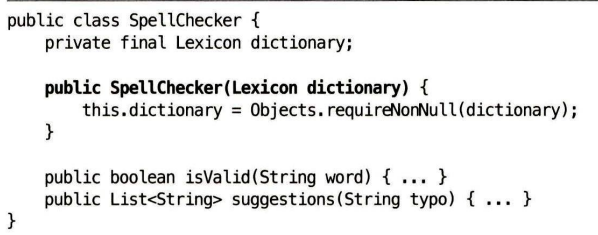
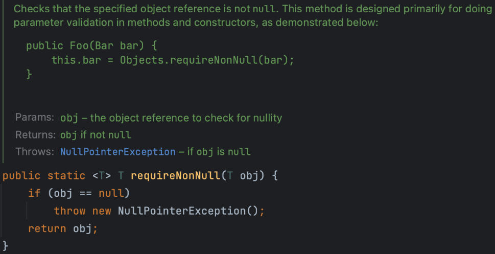

# 이펙티브 자바

# 아이템 5 - 자원을 직접 명시하지 말고 의존 객체 주입을 사용하라

많은 클래스가 하나 이상의 자원에 의존합니다.

정적 유틸리티를 잘못사용한 예 - 유연하지 않고 테스트하기 어렵다.

```java
public class Spellchecker {
	private static final Lexicon dictionary = •••;
	
	private SpellCheckerO {} // 객체 생성 방지
	public static boolean isValid(String word) { … }
	public static List<String> suggestions(String typo) { ... }
}
```

- dictionary는 한 번 정해지면 변할 수 없습니다.

→ 다른 언어 사전 환경에 맞게 바꾸고 싶어도 못 바꿈 → 유연성 부족

- public static boolean isValid

→ 정적 메서드는 “상속이나 다향성”의 이점을 전혀 사용하지 못함

→ Mock 객체로 대체하기 어려워 테스트의 어려움이 있음

**Mock는 무엇인가 ?**

- 의존성 주입이 불가능

→ 항상 내부 고정 객체를 사용함. 

→ 테스트 시, 가짜 사전을 넣을 수 없음

싱글턴 패턴을 잘못 사용함

```java
public class Spellchecker {
	private final Lexicon dictionary = ..•;
	
	private Spellchecker(...) {}
	public static Spellchecker INSTANCE = new SpellChecker(•..);
	
	public boolean isValid(String word) { ... }
	public List<String> suggestions(String typo) { ... }
}
```

instance가 공유됨

→ 멀티스레드 환경에서 공유 상태가 문제가 될 수 있음

사전을 단 하나만 사용한다고 가정한다는 점에서 그리 좋지 않은 방식

→ 사전은 고정이 아닐 수 있다.

## 어떻게 해결하면 좋을까 ?

1. final 한정자를 제거하고 ? 다른 사전으로 교체하는 메서드 추가 ?

❌ 안됨

→ 오류를 내기 쉬우며 멀티 스레드 환경에서는 사용이 불가능 함

### 정적 유틸리티 / 싱글턴이 부적절한 경우

- **자원에 따라 동작이 달라지는 클래스**에는
    
    정적 유틸리티 클래스나 싱글턴 방식이 **적합하지 않음**
    
    → 사전(dictionary) 등 외부 자원에 의존하는 경우
    

### 해결 방법: 생성자 주입 패턴

- 클래스 생성 시, 필요한 자원(예: 사전)을 **생성자에서 주입**
- 이는 **의존 객체 주입(Dependency Injection)**의 한 형태
- 다양한 자원에 대해 유연하게 대응 가능
- 테스트 시 **Mock 객체도 쉽게 주입 가능**

---



requireNonNull이란 ?

파라미터로 입력된 값이 null이라면 **NullPointerException**이 발생하고, 그렇지 않다면 입력값을 그래도 반환한다.



 

## 의존 객체 주입 패턴

- 생성자에 필요한 자원(의존 객체)을 직접 넘겨주는 방식
- 구조는 단순하지만 강력하며, 많은 개발자가 무의식적으로 사용
- 하나의 자원이든 여러 자원이든 **확장성과 유연성**이 뛰어남
- 주입된 자원을 **불변으로 관리**하면 여러 클라이언트 간 **안전한 공유** 가능

### 팩터리 변형: `Supplier<T>` 사용

- 자원을 직접 넘기는 대신, **팩터리(Supplier)**를 생성자에 주입할 수 있음
- 팩터리는 요청 시마다 **새 인스턴스**를 생성해주는 객체
- 자바 8의 Supplier<T> 인터페이스는 이를 표현하는 표준 방식

```java
Mosaic create(Supplier<? extends Tile> tileFactory) { ... }
```

- 한정적 와일드카드(`? extends Type`)를 통해 유연하고 안전한 타입 설계 가능

스프링(Spring) 같은 의존 객체 주입 프레임워크를 사용하면 이
런 어질러짐을 해소할 수 있다

### 아이템 5 정리

클래스가 내부적으로 하나 이상의 자원에 의존하고, 그 자원이 클래스 동작에 영향을 준다면 싱글턴과 정적 유틸리티 클래스는 사용하지 않는 것이 좋다.

이 자원들을 클래스가 직접 만들게 해서도 안 된다.

대신 필요한 자원을 (혹은 그 자원을 만들어주는 팩터리를) 생성자에 (혹은 정적 팩터리나 빌더에) 넘겨주자.

의존 객체 주입이라 하는 이 기법은 클래스의 유연성, 재사용성, 테스트 용이성을 기막히게 개선해준다.

---

### Q1. 싱글턴이 테스트에 불리하다고 했는데, 테스트 가능한 싱글턴을 설계하려면 어떤 패턴이나 방법을 적용해야 하나요?

- 예: 인터페이스 기반 설계 + DI 컨테이너 활용, 혹은 싱글턴을 외부에서 주입 가능한 구조로 감싸는 패턴 등

---

### Q2. 열거 타입 방식이 직렬화·리플렉션 공격에도 안전하다고 했는데, 이 방식은 Spring이나 JPA 같은 프레임워크와의 호환성에는 어떤 제약이 있을 수 있나?

- 예: JPA Entity는 enum을 상속할 수 없음 → 서비스 클래스에서 enum 싱글턴 사용 시 DI 적용 불가 문제 등