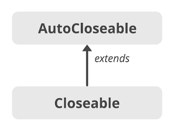

# 아이템 8 - Finalizer와 Cleaner 사용을 피하라

처음에 읽었으면 바로 보이는 단어 

### Finalizer 와 Cleaner는 객체 소멸자 기능이다.

이 둘은 예측이 불가능 하고, 성능 저하 및 보안상 문제를 일으킬 수 있어 사용을 지양해야한다.

대신, 자원 회수는 AutoCloseable과 Try-with-resources를 통해 명시적으로 처리해야합니다.

## 1. Finalizer의 문제점

### 예측 불가

- Finalizer는 객체가 GC에 의해 수거된 후 실행되지만, **언제 실행될지 보장할 수 없음**
- 심지어 **실행되지 않을 수도 있음**

GC 란 ? → 그 자바의 가비지 컬렉션을 줄여서 말했습니다.

### 성능 저하

- 일반 객체보다 **객체 회수 속도가 50배 이상 느림**
- GC의 효율을 떨어뜨림 → OutOfMemoryError 발생 가능성 증가

### 예외 무시

- Finalizer중 발생한 예외는 **무시되며 경고도 출력되지 않음**
- 객체가 **불완전하게 종료**되어 예측 불가한 동작 가능성 존재

### 보안 문제 (finalizer 공격)

- 예외가 발생한 생성 도중 객체가 partially alive 상태일 때 **악의적인 하위 클래스의 finalizer가 실행**될 수 있음
- 해당 객체가 정적 필드로 자신을 등록하면 GC에 의해 회수되지 않음
- 이를 통해 **접근이 불가능해야 할 작업을 우회적으로 실행** 가능

**Partially alive 란 ?**

객체가 완전히 생성되지 않았음에도 메모리에 존재하며, 일부 필드나 메서드에 접근 가능한 상태를 말합니다.

---

## 2. Cleaner는 대안이 될 수 있는가?

### Cleaner란?

- Java 9에서 소개된 finalizer의 대안
- Cleaner.create()를 통해 등록, Runnable을 통해 자원 해제 로직 수행

### Cleaner의 한계

- 여전히 **백그라운드 스레드에서 실행되며 즉시 호출되지 않음**
- System.exit() 전 호출 여부도 **보장되지 않음**
- 실행 보장 없음 → **중요한 자원 회수 작업에는 부적절**

---

## 3. 자바의 자원 회수 Best Practice

### try-with-resources와 AutoCloseable

- 명시적으로 자원을 해제하므로 예측 가능하고 안전함
- 자원 해제가 보장되어야 하는 경우 유일한 석

### Try-with-resources

```java
public static void main(String args[]) throws IOException {
    try (FileInputStream is = new FileInputStream("file.txt"); 
    
    BufferedInputStream bis = new BufferedInputStream(is)) {
        int data;
        while ((data = bis.read()) != -1) {
            System.out.print((char) data);
        }
    }
}
```



상식적으로 먼저 만들어진 인터페이스를 자식 클래스나 인터페이스에 사용하는 것이 일반적일 것이다.

하지만 Java 개발자들은 먼저 만들어진 Cloesable 인터페이스에 부모 인터페이스인 AutoCloesable을 추가함으로써 하위 호환성을 100% 달성함과 동시에 변경 작업에 대한 수고를 덜었다. 
 
 만약 Cloesable을 부모로 만들었다면 기존에 만들어준 클래스들이 모두 Cloesable이 아닌 AutoCloesable를 구현하도록 수정이 필요했을 것이다.

하지만 이러한 구조 덕분에 기존에 구현된 자원 클래스들 모두 try-with-resources가 사용가능해졌다.

---

### 보조 수단으로의 Cleaner

- 자원이 반드시 회수되어야 할 경우에는 부적절
- 클라이언트 코드에서 close() 호출을 **실수로 빼먹은 경우를 대비한 '안전망' 용도**

## Cleaner 사용 예제: Room 클래스

```java
public class Room implements AutoCloseable {
    private static final Cleaner cleaner = Cleaner.create();

    private static class State implements Runnable {
        int numJunkPiles;
        State(int numJunkPiles) {
            this.numJunkPiles = numJunkPiles;
        }
        @Override public void run() {
            System.out.println("방 청소");
            numJunkPiles = 0;
        }
    }

    private final State state;
    private final Cleaner.Cleanable cleanable;

    public Room(int numJunkPiles) {
        this.state = new State(numJunkPiles);
        this.cleanable = cleaner.register(this, state);
    }

    @Override public void close() {
        cleanable.clean();
    }
}
```

```java
public class Adult {
    public static void main(String[] args) {
        try (Room myRoom = new Room(7)) {
            System.out.println("안녕");
        }
    }
}
//  -> 안녕 -> 방 청소 순서대로 출력이 
```

하지만

```java
public class Teenager {
    public static void main(String[] args) {
        new Room(99);
        System.out.println("아무렴");
    }
}

//방 청소가 출력되지 않을 수 있음- > Cleaner의 실행 보장 X
```

## 4. Cleaner  Finalizer의 적절한 용도

### 1. 안전망

- 클라이언트가 close()를 호출하지 않았을 경우 최소한의 회수 역할
- ex) FileInputStream, ThreadPoolExecutor 등에서 내부적으로 사용

### 2. 네이티브 피어 자원 해제

- 네이티브 자원은 GC가 인식 못 하므로 cleaner로 처리 가능
- 단, **즉시 해제가 필요한 경우는 여전히 AutoCloseable로 처리해야 함**


### 네이티브 자원이란?
- 자바 힙 안에 있는 객체는 GC가 관리하지만, GC는 힙 밖에 있는 자원을 인식하지 못함
- 예르들어 ... DB커넥션이나.. 파일 핸들, GPU 메모리등이 있다고 생각합니다.

### 네이티브 피어란?
- 자바 객체가 이런 네이티브 자원에 대한 참조자(핸들) 역할을 하는 경우, 이 자바 객체를 네이티브 피어라고 부릅니다.
---

도움을 받은 블로그

[https://mangkyu.tistory.com/217](https://mangkyu.tistory.com/217)

[https://inpa.tistory.com/entry/JAVA-☕-예외-처리-Try-With-Resource-문법](https://inpa.tistory.com/entry/JAVA-%E2%98%95-%EC%98%88%EC%99%B8-%EC%B2%98%EB%A6%AC-Try-With-Resource-%EB%AC%B8%EB%B2%95)