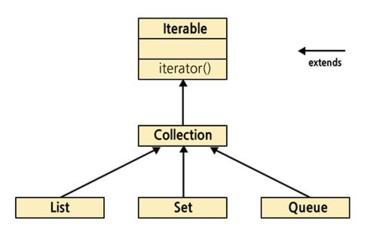

# 아이템 47 - 반환 타입으로는 스트림보다 컬렉션이 낫다

## 기본은 컬렉션 인터페이스이다.

자바 7까지는 메서드의 반환 타입으로 collection, set, list 같은 컬렉션 인터페이스, 혹은 iterable이나 배열을 썻다.

이중 가장 적합한 타입은 당연 컬렉션 인터페이스이다.

for-each문에서만 쓰이거나 반환된 원소 시퀀스가 일부 collection 메서드를 구현할 수 없을때는 iterable 인터페이스를 썻다.

---

## 그런데 자바 8이 스트림이라는 개념을 들고 오면서 !!!

- 스트림은 반복을 지원하지 않는다.
- 따라서 스트림과 반복을 알맞게 조합해야 좋은 코드가 나온다.

Stream인터페이스는 iterable 인터페이스가 정의한 추상 메서드를 전부 포함할 뿐 아니라 iterable이 정의한 대로 동장한다.

→ 그러나 foreach로 스트림을 반복할 수 없는 까닭은 바로 stream이 iterable을 확장하지 않아서이다.

```bash
for (ProcessHandle ph : ProcessHandle.allProcessesO::iterator) {
	// 프로세스를 처리한다.
}

//-> 하지만 컴파일 오류를 낸다.
Itreable로 적절히 형 변환을 해줘야한다.
```

---

```bash
for (ProcessHandle ph : (Iterable<ProcessHandle>)
	ProcessHandle.allProcessesO :: iterator){
	// 프로세스룔 처리한다.
}

작동은 한다 -> 근데 이게 뭐야 ... 할 듯 싶다.
```

---

## 어댑터를 끼워넣자

```bash
public static <E> Iterable<E> iterableOf(Stream<E> stream) {
	return stream::iterator;
}
```

```bash
for (ProcessHandle p : iterableOf(ProcessHandle.allProcesses())) {
	// 프로세스를 처리한다.
}
```

• 이렇게 어댑터를 작성해서 잘 사용하면 어떤 스트림도 for-each 문으로 반복할 수 있다.

---

## Iterable를 Stream으로 중개해주는 어댑터

```bash
public static <E> Stream<E> streamOf(Iterable<E> iterable) {
	return StreamSupport.stream(iterable.spliterator(), false);
}
```

### 이 메서드가 오직 스트림 파이프라인에서만 쓰인 걸 안다면 스트림을 반환하게 해주자.

### 반대로 반환된 객체들이 반복문에서만 쓰일 걸 안다면 Iterable을 반환하자.

하지만 공개 API를 작성할 때는 스트림 파이프라인을 사용하는 사람과 반복문에서 쓰려는 사람 모두를 배려해야한다.



### Collection 인터페이스는 Iterable의 하위 타입이고 stream 메서드도 제공
하니 반복과 스트림을 동시에 지원한다.

```java
// 공개 API 메서드가 Stream을 반환하는 경우
public Stream<Thing> getThings() {
}

// 컴파일 에러 발생!
for (Thing t : api.getThings()) { // <- 불가능
  System.out.println(t);
}
```

```java
// 공개 API 메서드가 Collection을 반환하는 경우
public List<Thing> getThings() {
    // ...
}

// 아주 잘 동작함!
for (Thing t : api.getThings()) {
  System.out.println(t);
}

// 아주 잘 동작함!
api.getThings().stream()
   .filter(...)
   .forEach(System.out::println);
```

## 정리

- 사람들은 stream으로도 반환을 하고싶고 collection으로도 반환을 하고싶을 것이다.
- 그렇지만 stream으로 반환을 한다면 반복문을 사용하고 싶은 개발자 들에게는 안타까운 소식이다.
- 그렇기에 open api 인경우에는 모두의 니즈에 맞게 collection반환을 하자.
- 만약 추후에 Stream인터페이스가 Iterable을 지원하도록 자바가 바뀐다면 ?
그때 써도 될거같다.